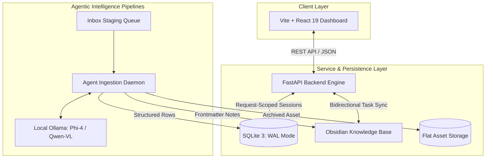

# Athena OS: Cybernetic Personal Telemetry & Agentic Knowledge Platform

<div align="center">


[](https://github.com/colbygross/athena/actions/workflows/ci.yml)

<p align="center">
  <strong>An autonomous full-stack personal telemetry and knowledge operating system bridging local multi-modal LLMs, double-entry financial ledgering, biometric tracking, and bidirectional Obsidian knowledge base synchronization.</strong>
</p>

</div>

---

## 🌟 Visual Showcase

<div align="center">
  
</div>

<br />

| Subsystem | Telemetry Capability |
| :--- | :--- |
| **Command Cockpit** | High-density telemetry cards, dynamic vitals trends, active task streams, and system heartbeat. |
| **Financial Ledger** | Double-entry transaction accounting, monthly category budget limits, and recurring bill trackers. |
| **Multi-Modal Ingestion** | Local vision models (Qwen-VL) and LLMs (Phi-4) extract JSON from PDFs and receipts into SQLite. |
| **Biometric & Habits** | Blood pressure, sleep architecture, resting telemetry, and recurring habit streaks. |
| **Career Pipeline** | Automated job discovery scanner, application status kanban, and AI resume tailoring. |

---

## 🏛️ System Architecture

Athena OS unifies relational SQL speed with human-readable Markdown notes, orchestrating background agent daemons to ingest, categorize, and cross-reference daily life telemetry.



### Storage Triad
1. **SQLite 3 Engine (`life_dashboard.db`)**: High-speed relational storage with strict foreign keys (`PRAGMA foreign_keys = ON`), write-ahead logging (`WAL`), and 14 structured tables.
2. **Obsidian Vault (`obsidian_vault/`)**: Human-readable Markdown knowledge base with YAML frontmatter tags, task checkmarks, daily morning briefs, and nightly retrospectives.
3. **Immutable Flat Storage (`storage/`)**: Deterministic file repository storing raw digital assets (receipt images, financial PDFs, academic papers) renamed to `YYYY-MM-DD_recommended_name.ext`.

---

## ⚡ Key Technical Highlights

- **Local Multi-Modal AI Document Processing**: Ingests invoices, blood test lab panels, and receipts via local Ollama instances (Phi-4 Mini & Qwen-VL 2B) with zero third-party cloud data egress.
- **Bidirectional Markdown-to-SQL Sync**: Scans `obsidian_vault/tasks.md` and project notes to keep SQLite database tasks synchronized with human-edited checkboxes.
- **Double-Entry Financial Ledger**: Enforces relational balance calculations across multiple accounts (Checking, High-Yield Savings, Credit Cards, Cash) with automated recurring transaction detection.
- **Reactive Cybernetic HUD**: Styled with bespoke cyberpunk telemetry aesthetics, custom typography (`PP Fraktion Mono`, `KH Interference`), glassmorphic panels, and animated visual feedback.
- **Zero-Rebuild Containerized Workflow**: Staging Docker environment leverages host bind-mounts and Vite HMR to deliver sub-50ms frontend updates and 500ms backend restarts without container recomposition.
- **Synthetic Telemetry Seeder**: Included database generator produces 30 days of realistic, anonymized data for instant reviewer evaluation.

---

## 🚀 Quickstart & Setup

### Option 1: 1-Command Docker Quickstart (Recommended)

Experience Athena OS immediately with pre-built multi-stage Docker containerization:

```bash
# 1. Clone the repository
git clone https://github.com/colbygross/athena.git
cd athena

# 2. Copy environment template
cp .env.example .env

# 3. Seed demonstration telemetry data
python3 backend/seed_demo_data.py

# 4. Launch with Docker Compose
docker compose up -d
```

Open your browser to **`http://localhost:8000`** to explore the dashboard. API documentation is accessible at **`http://localhost:8000/docs`**.

---

### Option 2: Local Development Setup (Manual)

#### Prerequisites
* **Python 3.12+**
* **Node.js 20+** & **npm**
* **Poppler Utils** (`sudo apt install poppler-utils` on Ubuntu/Debian, `brew install poppler` on macOS)

#### 1. Backend Setup
```bash
# Create and activate Python virtual environment
python3 -m venv .venv
source .venv/bin/activate

# Install dependencies
pip install -r backend/requirements.txt

# Seed demonstration telemetry
python backend/seed_demo_data.py
```

#### 2. Frontend Setup
```bash
cd frontend
npm install
```

#### 3. Launching Services
Run the unified launch script from the project root:
```bash
./launch_dashboard.sh
```
* **Frontend UI**: `http://localhost:5173`
* **FastAPI Backend**: `http://localhost:8000`

---

### Option 3: Development Environment with Hot-Reloading

For live code iteration with containerized dependencies:
```bash
docker compose -f docker-compose.dev.yml up -d
```
* **Frontend (Vite HMR)**: `http://localhost:5174`
* **Backend (Uvicorn WatchFiles)**: `http://localhost:8001`

---

## 🤖 Local LLM Ingestion Configuration

Athena OS natively supports local AI processing using [Ollama](https://ollama.com):

1. **Install and start Ollama**:
   ```bash
   ollama pull phi4-mini:latest
   ollama pull qwen3-vl:2b
   ```
2. **Enable in `.env`**:
   ```ini
   LLM_ENABLED=true
   OLLAMA_BASE_URL=http://localhost:11434
   OLLAMA_MODEL=phi4-mini:latest
   OLLAMA_VISION_MODEL=qwen3-vl:2b
   ```
3. **Drop files into `obsidian_vault/Inbox/`**:
   Execute the ingestion daemon to extract structured JSON and file companions:
   ```bash
   python backend/run_inbox.py
   ```

---

## 🗄️ Database Schema & CLI

Athena contains 14 relational tables managed with explicit indexing and cascade rules:

| Table | Purpose | Keys & Constraints |
| :--- | :--- | :--- |
| `accounts` | Financial balances & account types | `id` PK, `name` UNIQUE, `type` CHECK |
| `transactions` | Double-entry income & expenses | `id` PK, `date`, `amount`, `account_id` FK |
| `budgets` | Monthly category spending caps | `id` PK, `category` UNIQUE, `limit_amount` |
| `recurring_transactions` | Automated bills and subscriptions | `id` PK, `account_id` FK, `interval` CHECK |
| `health_logs` | Daily vitals, blood pressure, sleep | `id` PK, `date` UNIQUE, `weight_lbs`, `systolic` |
| `fitness_logs` | Exercise duration, distance, calories | `id` PK, `date`, `activity_type`, `intensity` CHECK |
| `habit_logs` | Recurring micro-habit checklist | `id` PK, `UNIQUE(date, habit_name)` |
| `tasks` | Master task registry | `id` PK, `status` CHECK, `priority`, `category` |
| `learning_progress` | CS topic study logs | `id` PK, `topic`, `hours_spent`, `status` CHECK |
| `job_applications` | Career outreach pipeline | `id` PK, `company`, `role`, `status` CHECK |
| `calendar_events` | Unified schedule aggregator | `id` PK, `start_time`, `end_time`, `event_uid` UNIQUE |

### Interactive Command-Line Tool
Athena includes a dedicated CLI utility for fast terminal querying without opening SQLite sessions:
```bash
# View recent transactions
python backend/db_cli.py show transactions --limit 10

# Inspect fitness history
python backend/db_cli.py show fitness_logs --limit 5

# Execute custom SQL
python backend/db_cli.py query "SELECT category, SUM(amount) FROM transactions WHERE type='expense' GROUP BY category"
```

---

## 🧪 Testing & Verification

Comprehensive automated test suites cover database integrity, REST API endpoints, and agent pipelines:

```bash
# Run backend test suite
pytest backend/tests -v
```

---

## 📚 Deep-Dive Technical Documentation

For in-depth architectural breakdowns, explore the [`docs/`](docs/) portal:
- [🎨 System Design & HUD Styling](docs/styling.md)
- [🗄️ Database Architecture & Migration Engine](docs/database.md)
- [💻 Codebase & Service Layers](docs/codebase.md)
- [🗂️ Obsidian Vault Hierarchy & Markdown Protocols](docs/vault_structure.md)
- [🐳 Deployment, Multi-Stage Docker & Networking](docs/deployment.md)

---

## 📄 License

Distributed under the **MIT License**. See [`LICENSE`](LICENSE) for details.

Developed by **Colby Gross** ([GitHub](https://github.com/colbygross) • [colbydgross@gmail.com](mailto:colbydgross@gmail.com)).
