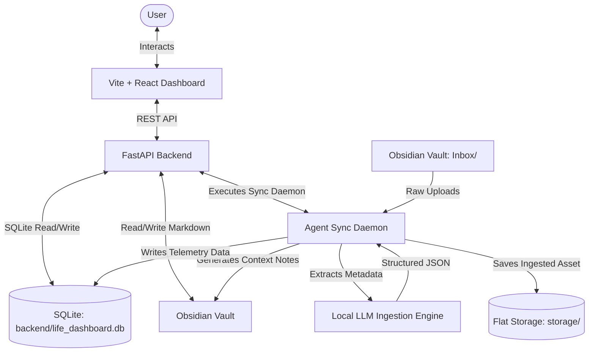

# Athena OS: Technical Architecture & Documentation Portal

Welcome to the central developer and system documentation portal for **Athena OS**. This portal acts as the architectural roadmap detailing the telemetry design system, database schemas, codebase services, and Obsidian knowledge base integration.

---

## 1. System Map Overview

Athena OS is an integrated personal telemetry system designed as a shared digital environment between a human operator and an agent companion. The system bridges a structured SQLite relational database with a flat-file markdown knowledge base.



---

## 2. Technical Guides

To inspect specific subsystems, navigate to the dedicated technical guides:

1. ### 🎨 [System Design & Styling](styling.md)
   * **Topics**: Telemetry HUD design tokens, custom typography (`PP Fraktion Mono`, `KH Interference`), glassmorphic panels, keyframe effects, custom widgets, and responsive layouts.
2. ### 🗄️ [Database Architecture & Schema](database.md)
   * **Topics**: SQLite database design, 14-table entity mapping, type constraints, foreign key cascades, WAL mode concurrency, and database migrations.
3. ### 💻 [Codebase & Service Layers](codebase.md)
   * **Topics**: FastAPI backend endpoints, Vite/React client views, bidirectional task synchronizers, calendar ICS handlers, and background execution scripts.
4. ### 🗂️ [Obsidian Vault Hierarchy](vault_structure.md)
   * **Topics**: Directory structure, frontmatter YAML format, daily briefs layout, night retrospectives, summaries generation, and storage layout.
5. ### 🐳 [Deployment & Containerization](deployment.md)
   * **Topics**: Multi-stage Docker production, hot-reloading development environment, persistent volume mounts, and network access configuration.

---

## 3. Repository Architecture

```
ATHENA/
├── backend/                    # FastAPI python services & SQLite engine
│   ├── database.py             # SQLite schema definitions & table migrations
│   ├── main.py                 # FastAPI routers & REST API controller
│   ├── agent.py                # Daily brief synthesizer, sync logic, vault parser
│   ├── db_cli.py               # Custom DB command-line management tool
│   ├── seed_demo_data.py       # Turnkey synthetic telemetry generator
│   ├── run_inbox.py            # Inbox multi-modal document pipeline
│   ├── run_daily_brief.py      # Morning brief generation cron
│   ├── run_nightly.py          # Nightly retrospective compiler
│   └── run_summaries.py        # Periodic rolling summaries generator
├── docs/                       # Technical architecture documentation (this folder)
├── frontend/                   # Vite + React Client Dashboard
│   ├── src/
│   │   ├── App.jsx             # Main dashboard UI component, telemetry state
│   │   ├── index.css           # Core styling system, variables, typography
│   │   └── main.jsx            # React root mount script
│   ├── vite.config.js          # Vite compilation configurations
│   └── package.json            # Client dependencies and npm script hooks
├── Dockerfile                  # Multi-stage production container
├── Dockerfile.dev              # Development container with hot-reload dependencies
├── docker-compose.yml          # 1-Command production compose stack
├── docker-compose.dev.yml      # Development compose environment with live reload
├── obsidian_vault/             # Obsidian knowledge base structure
├── skills/                     # Agentic automation skills & CLI tools
└── storage/                    # Processed digital document repository
```
