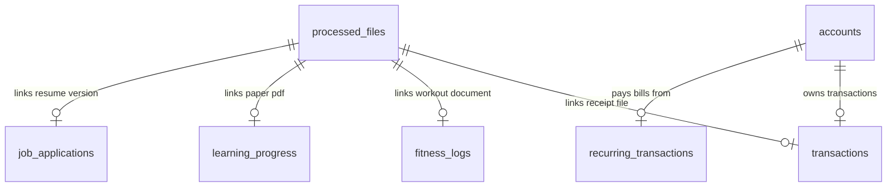

# Database Architecture & Schemas

Athena OS uses an **SQLite database** as its primary structured storage layer. It is configured to run with strict relational integrity, enforcing foreign key relationships and checking fields using constraint validations.

*   **Database Path**: [backend/life_dashboard.db](../backend/life_dashboard.db)
*   **Initialization Source**: [backend/database.py](../backend/database.py)

---

## 1. Database Schema Specifications

The database contains 15 active tables. Below is the technical breakdown of each table, including data types, default parameters, and constraints.

### 1. processed_files
Tracks files uploaded to the Vault Inbox that have been processed and moved to flat storage.
*   `id` (INTEGER PRIMARY KEY AUTOINCREMENT)
*   `original_name` (TEXT NOT NULL) — e.g. `receipt_starbucks.jpg`
*   `new_path` (TEXT NOT NULL) — Renamed path in `storage/` (`YYYY-MM-DD_recommended_name.ext`)
*   `category` (TEXT CHECK(category IN ('finances', 'health', 'fitness', 'learning', 'career', 'general')) NOT NULL)
*   `description` (TEXT)
*   `processed_at` (DATETIME DEFAULT CURRENT_TIMESTAMP)

### 2. accounts
Tracks individual financial accounts and balances.
*   `id` (INTEGER PRIMARY KEY AUTOINCREMENT)
*   `name` (TEXT NOT NULL UNIQUE) — e.g. `Checking`, `Savings`
*   `type` (TEXT CHECK(type IN ('checking', 'savings', 'credit_card', 'investment', 'cash')) NOT NULL)
*   `starting_balance` (REAL DEFAULT 0.0)

### 3. budgets
Tracks monthly limits for spending categories.
*   `id` (INTEGER PRIMARY KEY AUTOINCREMENT)
*   `category` (TEXT NOT NULL UNIQUE) — e.g. `food`, `rent`
*   `limit_amount` (REAL NOT NULL)

### 4. recurring_transactions
Tracks automated recurring bills and subscriptions.
*   `id` (INTEGER PRIMARY KEY AUTOINCREMENT)
*   `name` (TEXT NOT NULL) — e.g. `Xfinity Internet`
*   `amount` (REAL NOT NULL)
*   `interval` (TEXT CHECK(interval IN ('weekly', 'monthly', 'yearly')) NOT NULL)
*   `category` (TEXT NOT NULL)
*   `account_id` (INTEGER REFERENCES accounts(id) ON DELETE CASCADE)
*   `next_due_date` (TEXT NOT NULL) — Format: `YYYY-MM-DD`
*   `active` (INTEGER DEFAULT 1) — `0` or `1` boolean flag

### 5. student_loans
Manages academic loans, interest rates, and balances. Excluded from general Net Wealth calculation.
*   `id` (INTEGER PRIMARY KEY AUTOINCREMENT)
*   `name` (TEXT NOT NULL UNIQUE)
*   `type` (TEXT CHECK(type IN ('subsidized', 'unsubsidized')) NOT NULL)
*   `balance` (REAL NOT NULL DEFAULT 0.0)
*   `interest_rate` (REAL NOT NULL DEFAULT 0.0) — Percentage rate (e.g. `5.5`)
*   `interest_accumulated` (REAL NOT NULL DEFAULT 0.0)

### 6. transactions
Double-entry financial ledger recording income and expenses.
*   `id` (INTEGER PRIMARY KEY AUTOINCREMENT)
*   `date` (TEXT NOT NULL) — Format: `YYYY-MM-DD`
*   `amount` (REAL NOT NULL)
*   `type` (TEXT CHECK(type IN ('income', 'expense')) NOT NULL)
*   `category` (TEXT NOT NULL)
*   `merchant` (TEXT)
*   `description` (TEXT)
*   `file_id` (INTEGER REFERENCES processed_files(id) ON DELETE SET NULL)
*   `account_id` (INTEGER REFERENCES accounts(id) ON DELETE SET NULL)

### 7. fitness_logs
Tracks physical activities, workouts, and energy expenditures.
*   `id` (INTEGER PRIMARY KEY AUTOINCREMENT)
*   `date` (TEXT NOT NULL) — Format: `YYYY-MM-DD`
*   `activity_type` (TEXT NOT NULL) — e.g. `run`, `lift`, `kickboxing`, `recovery`
*   `duration_minutes` (INTEGER)
*   `distance_km` (REAL)
*   `calories_burned` (INTEGER)
*   `intensity` (TEXT CHECK(intensity IN ('low', 'medium', 'high')))
*   `notes` (TEXT) — Populated with completed exercises in the workout regimen
*   `file_id` (INTEGER REFERENCES processed_files(id) ON DELETE SET NULL)

### 8. health_logs
Tracks vitals, wellbeing scores, sleep quality, and biometrics.
*   `id` (INTEGER PRIMARY KEY AUTOINCREMENT)
*   `date` (TEXT NOT NULL UNIQUE) — Format: `YYYY-MM-DD`
*   `weight_lbs` (REAL)
*   `sleep_hours` (REAL)
*   `mood` (TEXT) — Mood score 1-10 or summary
*   `systolic` (INTEGER) — Blood pressure systolic pressure
*   `diastolic` (INTEGER) — Blood pressure diastolic pressure
*   `notes` (TEXT)
*   `water_ml` (INTEGER DEFAULT 0) — Daily hydration log (ml)
*   `energy_level` (INTEGER) — Energy scale 1-10
*   `stress_level` (INTEGER) — Stress scale 1-10

### 9. meal_logs
Tracks food intake macros.
*   `id` (INTEGER PRIMARY KEY AUTOINCREMENT)
*   `date` (TEXT NOT NULL) — Format: `YYYY-MM-DD`
*   `meal_type` (TEXT CHECK(meal_type IN ('breakfast', 'lunch', 'dinner', 'snack')) NOT NULL)
*   `description` (TEXT NOT NULL)
*   `calories` (INTEGER)
*   `protein_g` (REAL)
*   `carbs_g` (REAL)
*   `fat_g` (REAL)

### 10. mindfulness_logs
Tracks meditation and breathing logs.
*   `id` (INTEGER PRIMARY KEY AUTOINCREMENT)
*   `date` (TEXT NOT NULL) — Format: `YYYY-MM-DD`
*   `activity_type` (TEXT NOT NULL) — e.g. `Meditation`, `Box Breathing`
*   `duration_minutes` (INTEGER NOT NULL)
*   `notes` (TEXT)

### 11. learning_progress
Study tracker for Computer Science, engineering, and personal finance topics.
*   `id` (INTEGER PRIMARY KEY AUTOINCREMENT)
*   `date` (TEXT NOT NULL) — Format: `YYYY-MM-DD`
*   `topic` (TEXT NOT NULL) — e.g. `Red-Black Tree Deletion`
*   `category` (TEXT NOT NULL) — e.g. `Computer Science`, `Finance`
*   `hours_spent` (REAL)
*   `notes` (TEXT)
*   `source_link` (TEXT) — e.g. GitHub commit or document link
*   `status` (TEXT CHECK(status IN ('in-progress', 'completed')) DEFAULT 'completed')
*   `file_id` (INTEGER REFERENCES processed_files(id) ON DELETE SET NULL)

### 12. job_applications
Tracks application leads, status, and salary bounds.
*   `id` (INTEGER PRIMARY KEY AUTOINCREMENT)
*   `date_applied` (TEXT NOT NULL) — Format: `YYYY-MM-DD`
*   `company` (TEXT NOT NULL)
*   `role` (TEXT NOT NULL)
*   `salary_range` (TEXT)
*   `status` (TEXT CHECK(status IN ('applied', 'interviewing', 'offered', 'rejected', 'withdrawn')) DEFAULT 'applied')
*   `job_description_url` (TEXT)
*   `notes` (TEXT)
*   `resume_file_id` (INTEGER REFERENCES processed_files(id) ON DELETE SET NULL)

### 13. habit_logs
Logs completion of daily micro-habits.
*   `id` (INTEGER PRIMARY KEY AUTOINCREMENT)
*   `date` (TEXT NOT NULL) — Format: `YYYY-MM-DD`
*   `habit_name` (TEXT NOT NULL) — e.g. `Code 1 Hour`
*   `completed` (INTEGER DEFAULT 0) — `0` (false) or `1` (true)
*   *Unique constraint*: `(date, habit_name)`

### 14. tasks
Synchronized checklists matching the Obsidian vault.
*   `id` (INTEGER PRIMARY KEY AUTOINCREMENT)
*   `title` (TEXT NOT NULL)
*   `category` (TEXT DEFAULT 'general')
*   `status` (TEXT CHECK(status IN ('pending', 'completed')) DEFAULT 'pending')
*   `due_date` (TEXT) — Format: `YYYY-MM-DD`
*   `completed_at` (DATETIME)
*   `source_file` (TEXT) — Relative vault path (e.g. `01_Projects/Thesis.md`)
*   `line_number` (INTEGER) — Specific checklist line number inside the note
*   `created_at` (DATETIME DEFAULT CURRENT_TIMESTAMP)
*   `priority` (TEXT DEFAULT 'medium') — `high`, `medium`, `low`
*   `importance` (TEXT DEFAULT 'minor') — `major`, `minor`

### 15. calendar_events
Event ledger synced from Google Calendar or local ICS schedules.
*   `id` (INTEGER PRIMARY KEY AUTOINCREMENT)
*   `title` (TEXT NOT NULL)
*   `description` (TEXT)
*   `start_time` (DATETIME NOT NULL) — Format: `YYYY-MM-DD HH:MM:SS`
*   `end_time` (DATETIME NOT NULL)
*   `source` (TEXT CHECK(source IN ('google', 'local_ics')) DEFAULT 'local_ics')
*   `event_uid` (TEXT UNIQUE) — Google Event ID or local ICS UID
*   `created_at` (DATETIME DEFAULT CURRENT_TIMESTAMP)

---

## 2. Entity Relationships Map



*   **Enforcement Rule**: Foreign keys are enabled on every connection block: `PRAGMA foreign_keys = ON;`.
*   **Cascade / Null Constraints**:
    *   Deleting an account cascades deletion to its recurring subscriptions.
    *   Deleting processed files sets the corresponding `file_id` columns in transaction and log records to `NULL` to prevent data loss.

---

## 3. Database Seed & Migrations

The database manages schema drift and initial environments inside `backend/database.py`:
1.  **Default Account Seeding**: If the `accounts` table is empty during initialization, three accounts are automatically seeded:
    *   `Checking` (type: checking, starting_balance: 0.0)
    *   `Savings` (type: savings, starting_balance: 0.0)
    *   `Credit Card` (type: credit_card, starting_balance: 0.0)
2.  **Schema Migration Routines**:
    *   **Transactions account_id**: Checks `transactions` table columns and dynamically adds `account_id` if missing, then maps existing records to `Checking`.
    *   **Vitals expansion**: Dynamically appends `water_ml`, `energy_level`, and `stress_level` to `health_logs` tables if they are absent.
    *   **Tasks detail expansion**: Dynamically appends `priority` and `importance` columns to the `tasks` table.

---

## 4. Custom SQLite CLI Tool (`db_cli.py`)

Athena OS includes a custom command-line interface tool at [backend/db_cli.py](../backend/db_cli.py). This tool enables direct database interactions without opening sqlite sessions.

### CLI Syntax Examples:
*   **List Tables**:
    ```bash
    ./backend/db_cli.py list-tables
    ```
*   **Show Recent Entries (Markdown output)**:
    ```bash
    ./backend/db_cli.py show transactions --limit 5
    ```
*   **Show Recent Entries (JSON format)**:
    ```bash
    ./backend/db_cli.py show health_logs --limit 2 --json
    ```
*   **Execute Raw SQL Query**:
    ```bash
    ./backend/db_cli.py query "SELECT category, SUM(amount) FROM transactions WHERE type='expense' GROUP BY category"
    ```
*   **Add Row Manually**:
    ```bash
    ./backend/db_cli.py add transactions '{"date": "2026-05-26", "amount": 15.00, "type": "expense", "category": "food", "merchant": "Subway", "account_id": 1}'
    ```
